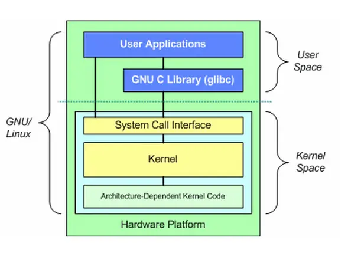

Linux分别为用户空间和内核空间两个部分。用户空间包括用户的应用程序、程序库等，内核空间包括系统调用接口、内核（狭义内核）、平台架构相关的代码。

Network Device Drivers：网络设备驱动，用于控制所有的网络接口卡及网络控制器。

Device Independent Interface：统一设备模型，定义描述网络硬件设备的统一方式，用一致的形式对驱动程序提供接口，实现所有的网络设备驱动都遵照统一定义，降低网络接口卡驱动程序的开发难度。

Network Protocols：实现网络传输协议，例如IP, TCP, UDP等。

Protocol Independent Interface：屏蔽下层的硬件设备和网络协议，实现用socket的标准接口支持网络通信。

System Call interface：系统调用接口，向用户空间提供访问网络设备的统一接口，各种网络管理工具通过调用该接口实现具体的功能。

## systemd-networkd 与 Network Manager

systemd是freedesktop的项目，官网 https://www.freedesktop.org/wiki/Software/systemd。该项目源码在 github 上发布，可以在 https://github.com/systemd/systemd 查看所有版本更新、 Bug Fix 和版本对应的文档等。systemd-networkd 是 systemd 默认提供的网络管理服务，可以完全管理以太网，但是不能够实现对无线网卡、PPP的管理。

systemd-networkd是用于管理网络的系统服务。它能够检测并配置网络连接， 也能够创建虚拟网络设备。

systemd-networkd的配置包括三个方面。

systemd.link：配置独立于网络的低级别物理连接。

systemd.netdev：创建虚拟网络设备。

systemd.network：配置所有匹配的网络连接的地址与路由。 在启动匹配的网络连接时，会首先清空该连接原有的地址与路由。 所有未被.network文件匹配到的网络连接都将被忽略(不对其做任何操作)。 systemd-networkd会忽略在 systemd.network文件中明确设为 Unmanaged=yes的网络连接。

当 systemd-networkd 服务退出时， 通常不做任何操作，以保持当时已经存在的网络设备与网络配置不变。 一方面，这意味着，从 initramfs 切换到实际根文件系统以及重启该网络服务都不会导致网络连接中断。 另一方面，这也意味着，更新网络配置文件并重启 systemd-networkd 服务之后， 那些在更新后的网络配置文件中已经被删除的虚拟网络设备(netdev)仍将存在于系统中， 有可能需要手动删除。

服务的配置文件分别位于： 优先级最低的 /usr/lib/systemd/network 目录、 优先级居中的 /run/systemd/network 目录、 优先级最高的 /etc/systemd/network 目录。

The NetworkManager daemon attempts to make networking configuration and operation as painless and automatic as possible by managing the primary network connection and other network interfaces, like Ethernet, Wi-Fi, and Mobile Broadband devices.

NetworkManager will connect any network device when a connection for that device becomes available, unless that behavior is disabled.

Information about networking is exported via a D-Bus interface to any interested application, providing a rich API with which to inspect and control network settings and operation.

The point of NetworkManager is to make networking configuration and setup as painless and automatic as possible. If using DHCP, NetworkManager is intended to replace default routes, obtain IP addresses from a DHCP server and change nameservers whenever it sees fit. In effect, the goal of NetworkManager is to make networking Just Work.

Whilst it was originally targeted at desktops, it has more recently been chosen as the default network management software for some non-Debian server-oriented Linux distributions,but understand that NetworkManager is not intended to serve the needs of all users.

NetworkManager includes three commands nmcli, nmtui and nmcli-examples。

CentOS操作系统上有NetworkManager和systemd-networkd两种网络管理工具，如果两种都配置会引起冲突。

CentOS 7及之后版本主要使用NetworkManager服务来实现网络的配置和管理，CentOS 7以前的版本主要是通过systemd-networkd服务管理网络。

system-networkd和NetworkManager是网络管理工具，主要通过对Linux Kernel进行交互，实现网卡、网络连接的配置、管理等。可以不借助任何工具，通过修改配置文件实现对网络配置信息的修改，然后通过systemd-networkd和NetworkManager启用配置信息并管理网络设备和服务。

## Linux操作系统的网络管理工具

Linux操作系统的网络配置和管理的工具分为四类：
	基于systemd-networkd或者NetworkManager的网络配置工具，
	网络管理工具，
	网络测试工具
	网络监控工具

网络配置工具有渊源深厚的net-tools，目前得到广泛支持的iproute2的ip模块，ubuntu积极推进的netplan，以及NetworkManager内置的nmcli、nmtui。网络配置工具主要是为用户提供操作接口，用户操作通过网络配置工具传递给systemd-networkd和NetworkManager，再由其通知Linux Kernel执行。通俗的讲，如果能够熟练的通过vi工具直接修改网络配置文件，则可以不安装和使用任何网络配置工具。

nmcli和nmtui工具是NetworkManager内置的配置工具。nmtui实现shell下的图形化管理，具有连接配置、连接激活和主机名配置功能。nmcli通过选项可以实现强大的网络配置功能，包括对网络连接、网卡设备、组播多播等进行配置管理。

netplan是配置网络连接的命令行工具，使用YAML描述文件来配置网络接口，并通过这些描述为任何给定的呈现工具生成必要的配置选项。ubuntu 18.04版本后默认使用netplan管理网络，详细介绍参看ubuntu的官方网站：https://netplan.io。

net-tools包含一组命令，包括常用的hostname、ifconfig、netstat等。iproute2使用ip命令和选项实现几乎所有的网络管理功能，如link、address、route等。

网络管理工具有很多，例如强大的网卡及网卡驱动管理工具ethtool，用于进行Linux Kernel流量控制的流浪控制器iproute2的tc模块（Traffic、Control）。

网络测试工具有耳熟能详的ping，进行路由追踪的traceroute，也特别推荐Linux操作系统上非常好用的网络诊断工具mtr。

网络监控工具有监控arp的arpwatch，监控网络接口流量的iftop，查找网络通信报文的ngrep，以及嗅探获取网络通信报文的tcpdump。

