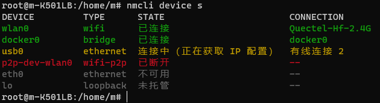

## NetWork Topics


随着移动蜂窝网络的发展，我们对数据连接的需求也在增加。电话、短信(CS业务)等任务已经不那么重要，客户更关心的，是网络数据连接需求。Quectel模组，从2G到5G，上下行速率也随着核心网的升级不断发展。其中使用Quectel模组，尤其是标准模组，是希望将Quectel模组作为一个网络接入方式，在客户的AP上，Quectel模组承担的是移动网络接入的功能。客户AP的外部网络连接走的就是Quectel模组。客户的AP上也有各种网络接口设备，如以太网卡、WIFI、虚拟网卡、网桥等。Quectel模组生成的网卡不是唯一网卡节点,因此为了满足客户产品应用的需求，就需要配置网络。


``` NonSense

我一直是觉得这应该是一个运维工程师的基本技能
	
	1.服务器网络配置（Centos/Redhat/Ubuntu）

	2.Linux Shell 快速脚本编写能力

	3.网络协议及抓包分析能力

然而我不是一个运维工程师，在入职移远之前，以上3点能力，1和2有一点点入门级，对3几乎是一无所知。

如何配置网络是工作重点。

我期望成功一个嵌入式工程师，或者起码是一个软件工程师，面对的代码，而不是我不会的皮球，丢不出去的皮球。
我也希望能够用自己知识，帮助客户解决问题，所以选择FAE这个部门。

现实和理想是

很大一部分工作，面对的是Linux网络配置，甚至超过协助客户移植Quectel驱动和工具使用。

非不能也，乃不为也。

既然还在这里工作，就把工作尽可能做好吧。

这些工作还有些做法

	1. 就是只要移远的网卡能拨号成功，其他一概不管

	2. 我本地验证OK，不管客户遇到的问题

	3. 拿掉客户的所有应用配置，再看看Quectel模组能不能用，没有问题就不管了

实际上遇到的工作是

	1.就算拿到IP，ping不通网络，遇到对网络了解很少的客户，他不会放过你的:) 如果我是客户，我也是这样的:)

	2.我觉得如果这样做，我下次绝对不用移远的产品

	3.这样已经排除了移远的问题，但是，客户可能对他的系统网络配置也不清楚，这和1其实没区别。在时间精力有限的情况下，会这么做。 

```


### 客户的网络需求

客户的系统分为两大类

- 桌面OS或者服务器OS

- 嵌入式系统

其中，桌面/服务器系统主要是Ubuntu/Debian/Centos这些及其衍生，这类的特点是系统Framework里有一套网络管理机制.

譬如 

其中usb0 是一个移远模组GobiNet生成的网卡。可见，usb0 被加进NetWorkManager里了。因此usb0 也会被NetWorkManager 统一管理。

这类系统包括 树莓派自带的操作系统，它也是基于Debian的。

嵌入式系统，主要指的是客户自行编译的，bootloader、kernel、rootfs都有源码，尤其是指rootfs是用Buildroot编译得到的，基于emdebian编译得到的rootfs更接近桌面/服务器OS。嵌入式系统也可以根据rootfs划分成上层有明确网络管理的和没有确定的网络管理的网络管理的。

有明确网络管理的，指客户移植了一些网络管理应用，譬如客户移植了modemmanager、libqmi等，也包括OpenWrt系统。OpenWrt的网络配置在互联网搜索引擎上能找到很多资料，也有强大的社区服务支持。

嵌入式系统的特点是，经过裁剪后的系统，客户可能连内核配置了哪些内核模块、网络协议栈都不清楚，许多网络相关的工具都没有，譬如没有dhcp client工具，没有tcpdump，vim不可用，dos2unix也没有，系统里的可用空间也也很小，需要挂载nfs.

以下主要针对以上两类系统进行学习。

##基础命令

----

###路由

[gateway](gateway)

[route](route)


###其他

[ss](ss)


##NetWorkManager

### nmcli

[nmcli](nmcli)

### nmtui

[nmtui](nmtui)

### systemd-network

[systemd-network](systemd-network)

[systemd-network](systemd-network2)


