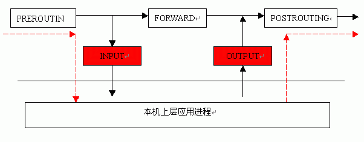

### ufw

LInux原始的防火墙工具iptables由于过于繁琐，所以ubuntu系统默认提供了一个基于iptable之上的防火墙工具ufw。

biao@WB:~$ ufw --help

Usage: ufw COMMAND

Commands:
 enable                          enables the firewall
 disable                         disables the firewall
 default ARG                     set default policy
 logging LEVEL                   set logging to LEVEL
 allow ARGS                      add allow rule
 deny ARGS                       add deny rule
 reject ARGS                     add reject rule
 limit ARGS                      add limit rule
 delete RULE|NUM                 delete RULE
 insert NUM RULE                 insert RULE at NUM
 route RULE                      add route RULE
 route delete RULE|NUM           delete route RULE
 route insert NUM RULE           insert route RULE at NUM
 reload                          reload firewall
 reset                           reset firewall
 status                          show firewall status
 status numbered                 show firewall status as numbered list of RULES
 status verbose                  show verbose firewall status
 show ARG                        show firewall report
 version                         display version information

Application profile commands:
 app list                        list application profiles
 app info PROFILE                show information on PROFILE
 app update PROFILE              update PROFILE
 app default ARG                 set default application policy

	ufw enable/disable：打开/关闭ufw

　　	ufw status：查看已经定义的ufw规则

　　	ufw default allow/deny：外来访问默认允许/拒绝

　　	ufw allow/deny 20：允许/拒绝 访问20端口，20后可跟/tcp或/udp，表示tcp或udp封包。

　	ufw allow/deny servicename:ufw从/etc/services中找到对应service的端口，进行过滤。

　　	ufw allow proto tcp from 10.0.1.0/10 to 本机ip port 25：允许自10.0.1.0/10的tcp封包访问本机的25端口。

　　	ufw delete allow/deny 20：删除以前定义的允许/拒绝访问20端口的规则

	sudo ufw allow smtp　允许所有的外部IP访问本机的25/tcp （smtp）端口

　　	sudo ufw allow 22/tcp 允许所有的外部IP访问本机的22/tcp （ssh）端口

　　	sudo ufw allow 53 允许外部访问53端口（tcp/udp）

　　	sudo ufw allow from 192.168.1.100 允许此IP访问所有的本机端口

　　	sudo ufw allow proto udp 192.168.0.1 port 53 to 192.168.0.2 port 53

　　	sudo ufw deny smtp 禁止外部访问smtp服务

　　	sudo ufw delete allow smtp 删除上面建立的某条规则

ufw相关的文件和文件夹有：
　　/etc /ufw/：里面是一些ufw的环境设定文件，如 before.rules、after.rules、sysctl.conf、ufw.conf，及 for ip6 的 before6.rule 及 after6.rules。这些文件一般按照默认的设置进行就ok。

　　若开启ufw之 后，/etc/ufw/sysctl.conf会覆盖默认的/etc/sysctl.conf文件，若你原来的/etc/sysctl.conf做了修 改，启动ufw后，若/etc/ufw/sysctl.conf中有新赋值，则会覆盖/etc/sysctl.conf的，否则还以/etc /sysctl.conf为准。当然你可以通过修改/etc/default/ufw中的IPT_SYSCTL=条目来设置使用哪个 sysctrl.conf.

　　/var/lib/ufw/user.rules 这个文件中是我们设置的一些防火墙规则，打开大概就能看明白，有时我们可以直接修改这个文件，不用使用命令来设定。修改后记得ufw reload重启ufw使得新规则生效。

### iptables

||table|command|chain|Parameter & Xmatch| target |
|----|----|----|----|----|----|
|iptables||-t filter   nat | -A   -D   -L   -F   -P   -I   -R  -n | INPUT   FORWARD   OUTPUT   PREROUTING   POSTROUTING | -p tcp   -s   -d   --sport   --dport   --dports   -m tcp     state   multiport | -j ACCEPT   DROP   REJECT   DNAT   SNAT |
    

    
		|

