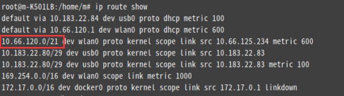
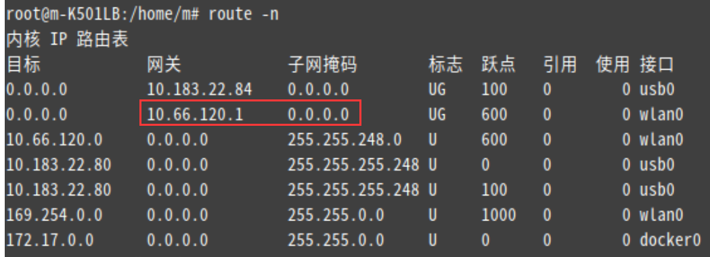
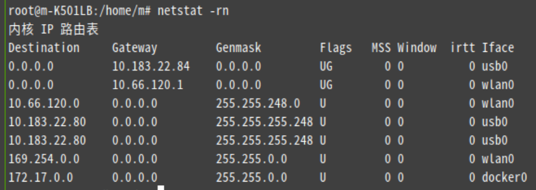
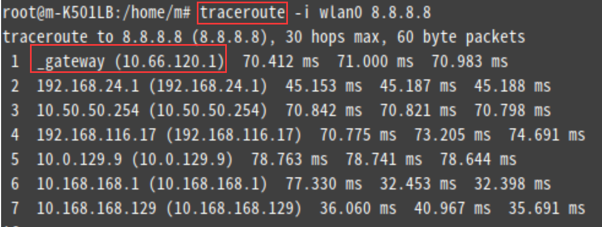

路由
=====

告诉主机如何发送数据给其他主机，如果主机充当路由器，主机负责不同网络之间转发数据。
路由是在IP层进行的，当收到一个目的地址是其他主机的报文后，本主机将网络地址和路由表中内容比较，如果目的地址是可以直接相连的网络，则直接将报文发送到该网络，如果没有匹配到的网络地址，则将该报文发送给某个默认路由器，由他进一步路由报文，如果没有默认路由，则返回给发送端一个网络不可达的信息。


静态路由：指由网络管理员手动一个个配置的路由表，是在网络小的情况下，可以用。

缺省路由：网络比较大的时候，用静态路由就比较不合适了。用缺省路由可以减少管理员的工作量。当路由表中匹配失败时，就会通过缺省路由进行转发。

默认网关：只要你想和不同网段通信，必须配置默认网关。比如A要发往B，要先判断B是否和自己在同一个网段，若是，则直接发；若不是，则要往网关发请求，由网关进行转发。

ip router 目的网络 掩码｛网关地址   接口｝

例子：

   （1） ip router 192.168.1.0 255.255.255.0  s0/0 

  解析： 这句话的意思是，路由器见到了目的网段为192.168.1.0的网段，就将这个数据包从接口s0/0中发送出去。

   （2）  ip router 192.168.1.0 255.255.255.0 192.168.2.0

解析：  这句话的意思是：在HOSTA上，路由器见到了目的网段为192.168.1.0的数据包，就将数据包发送到192.168.2.0网段上。也就是要想去往192.168.1.0，就要经过192.168.2.0 

默认路由的配置   

   默认路由既然属于静态路由的一种，那么他的配置就和静态路由是一样的。

 不过要将目的地的IP地址和子网掩码改成0.0.0.0和0.0.0.0.

## route 解释

Use 表示这条路由被系统引用的次数

Flags 用来描述路由特征

	U 表示此路由已经启用
	H 此路由的目标是一个主机
	G 此路由通过一个网关


## Get the current GateWay

1. ip route show



2.route -n or netstat -rn





3.traceroute




海外客户iproute2用比net-tools多。

## ip route 命令

``` ip route
Usage: ip route { list | flush } SELECTOR
       ip route save SELECTOR
       ip route restore
       ip route showdump
       ip route get [ ROUTE_GET_FLAGS ] ADDRESS
                            [ from ADDRESS iif STRING ]
                            [ oif STRING ] [ tos TOS ]
                            [ mark NUMBER ] [ vrf NAME ]
                            [ uid NUMBER ] [ ipproto PROTOCOL ]
                            [ sport NUMBER ] [ dport NUMBER ]
       ip route { add | del | change | append | replace } ROUTE
SELECTOR := [ root PREFIX ] [ match PREFIX ] [ exact PREFIX ]
            [ table TABLE_ID ] [ vrf NAME ] [ proto RTPROTO ]
            [ type TYPE ] [ scope SCOPE ]
ROUTE := NODE_SPEC [ INFO_SPEC ]
NODE_SPEC := [ TYPE ] PREFIX [ tos TOS ]
             [ table TABLE_ID ] [ proto RTPROTO ]
             [ scope SCOPE ] [ metric METRIC ]
             [ ttl-propagate { enabled | disabled } ]
INFO_SPEC := { NH | nhid ID } OPTIONS FLAGS [ nexthop NH ]...
NH := [ encap ENCAPTYPE ENCAPHDR ] [ via [ FAMILY ] ADDRESS ]
	    [ dev STRING ] [ weight NUMBER ] NHFLAGS
FAMILY := [ inet | inet6 | mpls | bridge | link ]
OPTIONS := FLAGS [ mtu NUMBER ] [ advmss NUMBER ] [ as [ to ] ADDRESS ]
           [ rtt TIME ] [ rttvar TIME ] [ reordering NUMBER ]
           [ window NUMBER ] [ cwnd NUMBER ] [ initcwnd NUMBER ]
           [ ssthresh NUMBER ] [ realms REALM ] [ src ADDRESS ]
           [ rto_min TIME ] [ hoplimit NUMBER ] [ initrwnd NUMBER ]
           [ features FEATURES ] [ quickack BOOL ] [ congctl NAME ]
           [ pref PREF ] [ expires TIME ] [ fastopen_no_cookie BOOL ]
TYPE := { unicast | local | broadcast | multicast | throw |
          unreachable | prohibit | blackhole | nat }
TABLE_ID := [ local | main | default | all | NUMBER ]
SCOPE := [ host | link | global | NUMBER ]
NHFLAGS := [ onlink | pervasive ]
RTPROTO := [ kernel | boot | static | NUMBER ]
PREF := [ low | medium | high ]
TIME := NUMBER[s|ms]
BOOL := [1|0]
FEATURES := ecn
ENCAPTYPE := [ mpls | ip | ip6 | seg6 | seg6local ]
ENCAPHDR := [ MPLSLABEL | SEG6HDR ]
SEG6HDR := [ mode SEGMODE ] segs ADDR1,ADDRi,ADDRn [hmac HMACKEYID] [cleanup]
SEGMODE := [ encap | inline ]
ROUTE_GET_FLAGS := [ fibmatch ]

```

只有设置好网关的IP地址，TCP/IP协议才能实现不同网络之间的相互通信。


## RIP 和 IGP 

RIP  Routing Information Protocol

IGP  Interior Gateway Routing Protocol


## 例子

需要接入内网进行调试，内网地址为5.0.217.47。另外接了个无线，可以上外网自动分配了个192.168.2.110。
插上内网网线，并成功连接上外网后，此时内网是通的，但是外网连接不上。在命令窗口使用ipconfig和route print命令可以打印出当前的信息：

``` example on WinOS
===========================================================================
Interface List
0x1  MS TCP Loopback interface
0x2 00 26 18 31 4f d1  Realtek RTL8168C(P)/8111C(P) PCI-E Gigabit Ether
net NIC - 数据包计划程序微型端口
0x3 00 24 2c e7 57 11  Atheros AR5006X Wireless Network Adapter - 数据
 
包计划程序微型端口
===========================================================================
Active Routes:
Network Destination        Netmask          Gateway       Interface Metric
          0.0.0.0          0.0.0.0        5.0.217.1      5.0.217.47       10
          0.0.0.0          0.0.0.0      192.168.1.1   192.168.1.110       25
        5.0.217.0 255.255.255.192       5.0.217.47      5.0.217.47       10
       5.0.217.47 255.255.255.255        127.0.0.1       127.0.0.1       10
    5.255.255.255 255.255.255.255       5.0.217.47      5.0.217.47       10
        127.0.0.0        255.0.0.0        127.0.0.1       127.0.0.1       1
      192.168.1.0    255.255.255.0    192.168.1.110   192.168.1.110       25
    192.168.1.110 255.255.255.255        127.0.0.1       127.0.0.1       25
    192.168.1.255 255.255.255.255    192.168.1.110   192.168.1.110       25
        224.0.0.0        240.0.0.0       5.0.217.47      5.0.217.47       10
        224.0.0.0        240.0.0.0    192.168.1.110   192.168.1.110       25
 255.255.255.255 255.255.255.255       5.0.217.47      5.0.217.47       1
 255.255.255.255 255.255.255.255    192.168.1.110   192.168.1.110       1
Default Gateway:       192.168.1.1
===========================================================================
Persistent Routes:
 None
ipconfig
 
Windows IP Configuration
Ethernet adapter 本地连接:
        Connection-specific DNS Suffix . :
        IP Address. . . . . . . . . . . . : 5.0.217.47
        Subnet Mask . . . . . . . . . . . : 255.255.255.192
        Default Gateway . . . . . . . . . :
Ethernet adapter 无线网络连接:
        Connection-specific DNS Suffix . :
        IP Address. . . . . . . . . . . . : 192.168.1.110
        Subnet Mask . . . . . . . . . . . : 255.255.255.0
        Default Gateway . . . . . . . . . : 192.168.1.1

```

由route print命令的结果的第一行可以看到，只所以访问不到外网，是因为默认的情况是通过5.0.217.1的内网的网关出去的。

为了达到能同时访问内外网的需求，只需要删除掉0.0.0.0的路由后，添加两条路由即可，将5开头的地址都通过5.0.217.1网关路由出去，而其余的地址都通过无线的网关192.168.1.110出去。参考如下：

	route delete 0.0.0.0
	route add 0.0.0.0 mask 0.0.0.0 192.168.1.1
	route add 5.0.0.0 mask 255.0.0.0 5.0.217.1


